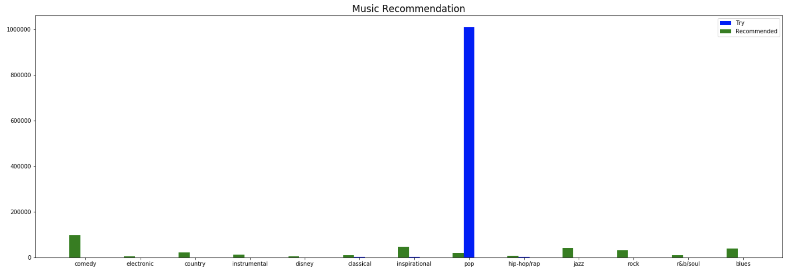
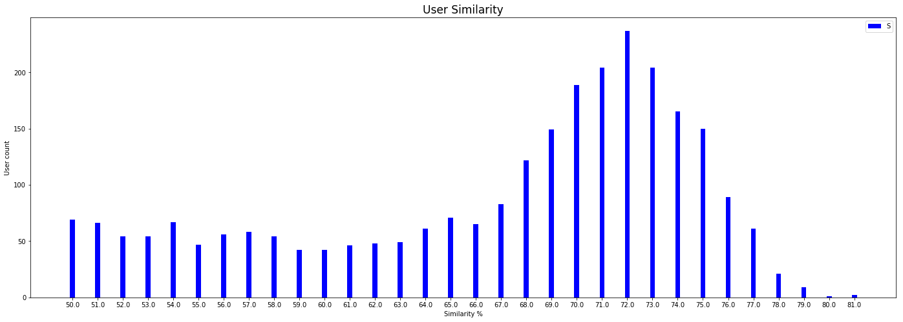
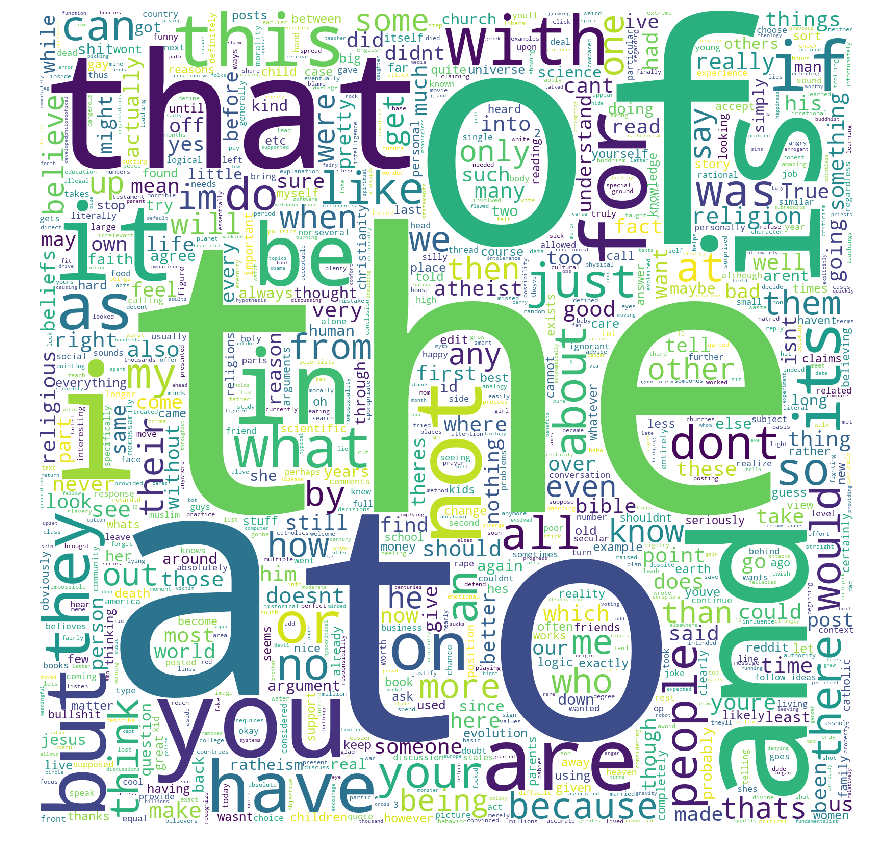

# Project 2: Social Network Analysis with MapReduce

This repository includes starter files and a sample directory structure. You are welcome to use it or come up with your own project structure.

Project Specification: https://www.cs.usfca.edu/~mmalensek/cs677/assignments/project-2.html

# Project Report

Example Post Json:
```
{
  "edited": false,
  "created_utc": "1325376000",
  "controversiality": 0,
  "body": "Isn't this against the first amendment? Doesn't the first amendment give us the right to assemble and protest?",
  "subreddit_id": "t5_2qh3l",
  "parent_id": "t3_nxrpq",
  "author_flair_text": null,
  "id": "c3ctzsj",
  "score": 5,
  "author_flair_css_class": null,
  "gilded": 0,
  "author": "goishin",
  "score_hidden": false,
  "retrieved_on": 1428104610,
  "ups": 5,
  "downs": 0,
  "name": "t1_c3ctzsj",
  "distinguished": null,
  "subreddit": "news",
  "archived": true,
  "link_id": "t3_nxrpq"
}
```

## Warmup

### [0.25pt] Total Count
How many records are in the dataset?
Elapsed Time: 3:32:02

Total number of entries: 2661983402

### [0.25pt] Unique Subs
How many unique subreddits are there?
Elapsed Time: 3:32:02 (Solved using same map reduce as records)

Number of subreddits: 417834

### [0.5pt] Most Comments
What user wrote the most comments in July of 2012? What was the user’s top three most-upvoted comments?
Elapsed Time: 1:14:01

I took the top commenter that appeared to not be a bot.

Posts from user: Apostolate

| upvotes | post body |
|---------|------|
| 1592 |  Many of my age group, under thirty, have grown up with all media free at their finger tips. Napster, limewire, torrenting, the internet, youtube, we want our content with no charge, with ads, and then we want to block those ads.\n\nThat's why people think this way. |
| 1608 | Love means saying sorry to one person a lot more than anyone else, and the difference is, they probably do forgive you. |
| 1637 | I live in new york, and all I have to say is, **** you. |
| 1863 | &gt;I don't want to be an Eagle Scout if a young man who is gay can't be one, too.\n\nThat's all that needed to be said. Great line. |

| user                	| posts   	|
|---------------------	|---------	|
| [deleted]           	| 4219324 	|
| qkme_transcriber    	| 18098   	|
| ModerationLog       	| 10223   	|
| Apostolate          	| 7978    	|
| AutoModerator       	| 7428    	|
| Late_Night_Grumbler 	| 6941    	|
| Lots42              	| 4126    	|
| original-finder     	| 4013    	|
| tweet_poster        	| 3980    	|

### [1 pt] Day of Significance
Choose a day of significance to you (e.g., your birthday), and retrieve a 5% sample of the comments posted on this particular day across all 5 years of the dataset.
Elapsed Time: 0:50:06

| type | Number of posts saved |
| ---- | ----- |
| Expected | 364405.7 |
| Actual | 329613 |

Expected = total_posts * 0.05 / 365.25

365.25 is average number of days over a 4 year span per year

### [1 pt] Comments per Month

The number of comments posted per year will likely trend upward over time as more users join Reddit. Use feature scaling to normalize the number of comments per month from 0.0 to 1.0 and plot the values for each year. This way, we can isolate the proportion of comments across months. Do you notice any patterns?

Elapsed Time: ~5:22:00

<!---->

## Analysis

|General Observations ||
|--------|----------------------|
|Users and subreddits with low comments tend to skew the data| To fix this we simply add a minimum number of comments required to actually be included into the results|
|Averages vs Absolute values | Averages are better for when we need equal representation between larger and smaller data sets otherwise we will use absolute values|
|Machine Learning vs Human Analysis| Overall for this project adding machine learning models add significant overhead to the data collection and for now we have decided to use human analysis replace the models in exchange for a performance increase| 
|Different jobs require different methods of cleaning| Much of our results gave us unhelpful information the first pass due to including all the data in the analysis. We had to spend time after removing deciding how to filter out certain outliers to get an accurate analysis|

### [1 pt] Screamers
It is well known that WRITING IN ALL CAPS ONLINE IS A SUBSTITUTE FOR SCREAMING… OR YELLING. *cough!* Write a job to find users that scream a lot, and provide a screamer score (a highly-technical metric expressed as the percentage of uppercase letters used in their comments).
* For future reference (when we really want to get something off our chest), what are the top 5 subreddits for scream-y comments?

  Initial thoughts was to take a flat score for each subreddit and count the number of capitol letters and take the values that are the highest. But upon inspection it seems that alot of the subreddits that either had 100% uppercase or 0% uppercase letters also had very few comments. In order balance out and get a more accurate measurement we only included subreddits with at least 50 comments to get a better representation of the true screamiest subreddit. We use the number 50 since I put the cutoff at 50 since that is how much information I believe to get a better sense of how screamy a subreddit is. 

*this tables is generated using data from 2012

| SubReddit               | Screamer Score              |
|-------------------      |----------------             |
| CircLoljerk  | 0.66468 	    |
| gats             | 0.6145077     |
| MinecraftCirclejerk | 0.6032342  |
| counting | .5589686  |
| GhettoJerk | .5549712 |

### [3 pt] Readability
Write a job that computes Gunning Fog Index and Flesch-Kincaid Readability (both reading ease and grade level) of user comments.

#### r/rarepuppers
Time: 6:32:00

Choose a subreddit and plot the distribution of these scores using a histogram.


#### Worst Subreddits
Time: ~6:00:00
Find three subreddits of inscrutables, with users that write extremely unreadable comments.

| Sub |FleschGrade| FleschEase | GunnGrade |
| --- | --- | --- |--- |
| weheartgossip | 20 | 0| 20
| gracit3 | 20 | 0 | 20|
| playmates |20  | 0 |20|
| Plugit | 20 | 0 |20|
| NSFW_OFFICIAL_XXX | 20 | 0 |20|

>>Somthing to note about the results only about 9 subreddits have results that are very polarizing, meaning using an absoulte metric without filtering may change the order of the screamer scores.

For this impelmentation we filtered out values below 0 and above 20 to be the minimum and maximum values in hopes of reducing the impact of highly unreadable values ( one word or words like (LOL) seems to be treated as highly unreadable even if they are not). In retrospec it seems that leaving them unfiltered would have given more accurate results or even just including comments with a certain number of comments. Despite this further testing has shown some critial limitation of the readabilty algorithms we used. From our understanding both these algorithms require a certain number of words to be effective, but on the internet comments are likely not to be longer than 100 words making these algorithms potentially inaccurate.

##### Limitation
On the internet many comments and typing style can lead to inconsistent results when using the Flesch-Kincaid Algorithm. Internet slang such as "lol" or "rotfl" can result in null values for this algorithm as well as comments being on average shorter than the posts themselves. Because of the lengh of the comments readablity can somtimes not be accuratly judged. In addition mispelled words or gibberish often get an extremely low readabilty score with is not useful for analysis and very very short comments also have a extremely high readability score also skewing the data (however these can be filtered out).


### [2 pt] Key Terms
Time: 6:43:48 (Setup) +  0:01:09 (Calculating TF IDF)

Calculate the TF-IDF for a given subreddit. Produce a Tag Cloud of the terms.


### [2 pt] Toxicity
Using Sentiment Analysis, determine the top 5 positive subreddits and top 5 negative subreddits based on comment sentiment.
Our original approach to the sentiment analysis was to use the Standford NLP library to generate a score based on average sentiment score and number of sentences. This apporach however was riddled with issue aside from not running due a difference in protobuf versions. 

| Pros                    | Cons         	              |
|-------------------      |----------------             |
| Accuracy is acceptable  | Library is very large 	    |
| Easy to use             | Take a long time to run     |
| Machine learning models | Lots of functions included but not used  |


As using the library has failed we approached the problem from a different perspective. Instead of using a machine learning model to determine sentiment, we decided to use a word list the consisted of a word and a value, the value being a positive or negative score based on the sentiment. Then we simply added up all the sentiment values to get an absolute value for negativity. An alternative was to use relative scores in order to normalize the data set. However using an absolute value seems to create the most readable results as we should not weigh a small subreddit the same as a large one. This is mostly because using a relative scale would acutally allow the subreddits with less comments to skew the data ( since one positive comment would automatically make them the most positive sub reddit ). 

| Pros                    | Cons         	              |
|-------------------      |------------	                |
| Easy to implement       | Accuracy is questionable    |
| Faster Computations     | Wordlist is much smaller     |
| Flexable word list      | Does Not handle Many Edge cases |

*Both these approaches fall short when looking at context of the comments. While you can see the sentiment of the sentence as a whole you cannot see the context of the comment which at times is very important to determining if a sentence is truly negative or not. Also both versions of sentiment analysis cannot detect satire very well possibly give "dark humour" a negative sentiment score when in reality it may not be the case. 

#### Absolute Sentiment Score (2012, 5% sample)
|Pos Subreddit|Sentiment Score |Neg Subreddit | Sentiment Score|
|------- |--------------- |--------|-----------------|
|trees| 10792.0779|news|-324.1795|
|pics| 9506.3160|MensRights|-440.3776|
|mylittlepony|4417.8108|4chan|-944.4091|
|funny|3667.3823|politics|-1668.8645|
|aww|3584.1785|worldnews|-1892.4820|

Interesting things about the anaylsis:
Even the most negative subreddit has a lower absolute value than the 5th postive subreddit. Upon further inspection it takes 15 subreddits to find a positive subreddit with the same absolute value as the most negative one. Of course this can be for a variety of reasons. I suspect it is because the method we used do not account for words that modify the meaning of other words. For example "I am very happy" is a postive sentence, but "I am NOT happy" is a negative one. While this can be also true for the reverse "I am not angry", I suspect that these sentences are not as common.

  It is ressuring that the subreddits listed seem to correctate to the topic. It does make sence that politics and news would have on average a negative sentiment score as those topics are highly polarized. While both trees and MensRights are clearly satirical (I hope), it is obvious that trees would have less offensive or negative content than MensRights. While I believe the sentiment of MensRights is most likely negative (but in a joking way?).  
  For the positive subreddits, I expect that those who comment on my little pony are probably fans of the show and would comment positive things about it. This also applies to funny and aw which also seem like subreddits that would not have upsetting content in contrast to somthing that can be potentially offensive. 

When Back an ran against the whole data set

|Pos Subreddit|Sentiment Score |Neg Subreddit | Sentiment Score|
|------- |--------------- |--------|-----------------|
|RandomActsOfPolish| 52455.52644769372| angry |-30481.471592720998|
|XMenRP |29556.540593803882   |RusherArmy2b2t| -7355.633770498682  |
|tf2trade |26903.774613497986  | SRSsucks| -6734.336193613602  |
|RateMyMayor |25334.415771556352  | conspiro |-5440.301571511907| 
|PotterPlayRP| 24449.421378759424   |  straya |-5391.570869786074 |   

These newer results seem to show a shift in content. This seems to show a flaw in our approach from before weighing based on popularity and sentiment score rather than just raw sentiment. Previously we identified the flaw in using an average ( giving extremely small subreddits an unfair advantage ) but using this method the opposite is true where more popular subreddits have the advantage. For this I propose a balance between them using averages on subreddits with more than X comments.

### [3 pt] Backstory

  The Backstory generator will not nessessary produce a backstory instance, but instead it will produce a range of metrics that can be reused in future jobs. Instead for this question we will simply be constructing a story these metrics to produce a backstory for a use. Since there are not many backstories to analysis in this particualar case (we are only analysis three) We can do this by hand but in the future if we were to implement this on a larger scale, we would use a machine learning model to generate a back story. While a script could also work to find a backstory, it would not be very detailed since much of a users personality and traits are actually found by looking into the subreddits that they visit rather than the raw metrics we have defined. In the documentation belowwe have included a human analyed backstory with detailed analysis and methodologies.

|Trait | Description| Implementation summary|
|------|------------|-----------------------|
|Temperment| The Users overall temperment, | Uses Sentiment analysis to determine if the person is a overall a positive or negative person
|Readabilty Score| A guess on the level of education of a user| We can use the readabilty of a users comments to make a guess on education level
|Number of Comments| The number of comments a user posts | Tracks the number of comments a users postes over time
|Agreeability | See how well a user gets along with other people | Using average upvotes we can see how agreeable a user is. More upvotes means a higher agreeablity score.
|Location | Where this user is located| Tracks certain phrases to deduce location
|Likes | What the users interests are | We can assume that if a user comments on a subreddit it is something they have an interest in

*a note for the dislikes: It is very difficult to find out what a user dislikes based on their reddit activity (the subreddits that users visit). This is because for the vast majority of people will not be visiting reddits that they have no interested in. An alterative way to actually track the dislikes of a user may require some more natural language processing to get dislikes based on comments and sentiment.

*We will structure the analysis as follows, First part of the user analysis can be done with a script, Second part will be analysis personality based on subreddit activity.


#### MikeMarx153

|Trait| Value|
|-------|-----------------------|
|User|MikeMarx153|
|Toxic Score| 0.007|
|Readabilty Score | 62.72|
|Comment Count | 52|
|Upvotes | 5.2|
|Location | null|
|Liked Subreddits | loseit:18, books:4, science:4, adviceanimals:4, fatlogic:3, funny:3, nutrition:2, fitness:2, politics:1, asianamerican:1|
 
##### What we know about MikeMarx153:
  For the table above we can see that this user is quite an agreeable person overall. His neutral toxicity score indicates that he must not be a particular negative person and seems to post either both postive and negative comments or most flat comment on the posts. In addition he seems to be a user that does not comment on post alot but does on average get a 5 upvotes per post making him have a total of 260 upvotes. This means he likely does not post unless information and using has somthing constructive to bring to a conversation.

  From his likes we can deduct that he may be an slightly overwieght asain-american around high school. His most visited sub reddit "lose it" is primariy a fat lose subreddit and this in combiniation 3 other fitness related subreddits shows me that he is trying to lose weight as about half of his comments are related to fitness. In addition he seems enjoy books and science and probably has a pet (most likely a dog). This user seems to have enough common sense to not post his location on the internet but based on his race we can see that he is likely either from california or texas. While he this does show his top ten subreddits he also goes to 10 other subreddits that are not accounted for that can expand on his backstory.


#### IlikeHistory

|Trait| Value|
|-------|-----------------------|
|User|IlikeHistory|
|Toxic Score| 0.0037|
|Readabilty Score | 36.814|
|Comment Count | 178|
|Upvotes | 20.63|
|Location | null|
|Liked Subreddits | atheism:55, AskReddit:42, todayilearned:36, AskHistorians:20, history:6, bestof:6, IAmA"4, movies:3, books:3, TrueReddit:1|

##### What we know about IlikeHistory

  One of the first things that stand out for this user is that his name correlates with his interest alot. From his sentiment score and education level in combintion with his interest, it seems that much of the comments are factual by nature rather than opinionative lacking words that can be thought of as postive or negative. This user has a resonably large presence on reddit making 178 comments. Despite using neutural language it seems this user mostly post helpful comments, which results in a very high average upvote count bring his total upvotes to 3560. His high average upvotes indicates that this user only post comments which are help or constructive to the topic.

  This user is Likely atheist as that is the subreddit that the user visits the most. Anouther alternative is that he is a religous person who like to go on atheist subreddits and pick fights with other users, but this would reflect on his average upvotes and is likely not the case. This user is most likely in college either doing a master or is graduating soon based on the readablity of his comments. However this may be an issue with the Flesch-Kincaid algorithm as historical words and pronouns are possibly weighted quite low skewing the score. While this user does "like history" it seems he actually goes on history subreddits less than expected, having only 14% of his comment activity on history subreddits. But this also may be misleading as we do not have data on how often one visits a subreddit. It is possible history subreddits are in fact his most VISITED subreddits but based on his comment trends it is likely he will not comment unless the user has something contructive. This means that he may very much just enjoy reading through the subreddit and not post useless/meaningless comments like "haha" or "lol".

#### Psychocoolguy
 
|Trait| Value|
|-------|-----------------------|
|User|Psychocoolguy|
|Toxic Score| -0.0024|
|Education | 33.8688|
|Comment Count | 129|
|Upvotes | 1.124|
|Location | null|
|Liked Subreddits | Fireteams:92, pokemongo:20, Smite:11, DestinyTheGame:4, Overwatch:2|

##### What we know about Psychocoolguy
  From the table above se can see that he is mostly neutral in terms of toxicity, however unlike the previous users that we have identified it is likely because of polarizing comments the cancel each other out rather than the use of neutral langauge. This is becasue his average upvotes are relativly low telling us that he is likely getting some comments that are getting lots of upvotes and some getting lots of downvotes. His low readabilty score shows me that he is also makes is comments are not exactly short as it is much more difficult to get a low readabilty score when the user makes small comments. While overall he is mostly accepted it is likely that he does post upsetting comments from time to time keeping his overall average upvote count low dispite having a high comment count.
  
  It is clear by looking at the subreddits user comments on that he is a gamer. While estimating age with the previous users was relativly straight forword, estimating the age of psychocoolguy seems to be problematic as there are too many factors that can skew his readabity score. The best we can do to estimate this persons age is using the gamer demographic making this person likly a male between 15 and 30. Looking into the FireTeams subreddit it seems to be a community for gamers to get together. This implies that he may or may not have any friends in his friend group that is interested in the games he is interested in leading him to conduct his search on reddit.


### [2 pt] A day in the life
Time: 2:31:10

You are a struggling scriptwriter trying to make it big in Hollywood. Find an interesting user with your backstory job, then trace their commenting activities across the site over time. Use this combination of data to build a story about the user’s life: what they do on a regular basis, who their friends are, their hopes/dreams, etc. You have some creative license here.

In order to create this I took the first sentence of every post he
wrote, the sub he wrote on and a bunch of other info using map reduce.
I then used reservoir sampling to take one post per month. The intro scene
was based statistical analysis of the subreddits he posts on.

Camera blurs into focus.
Inside of small rural house.
A young southern man wearing a NFL shirt, yelling loudly at his mother.
The mother is crying.

> Man: No mom! You're wrong. God doesn't exist!
> <br/> Mother: I...
> <br/> Man: I can't live in a house where people can't even see the truth in front of their eyes!

Man leaves and slams the door behind him

Then comes an oddly long and chaotic montage, leaping forward a month at a time.

> 12-01:  I agree with you the last bit (religion promoting illegal activity) is a ridiculous claim made by the Bishop to appeal to conservatives.
> <br/>12-02: You are using it correctly.
> <br/>12-03: Why don't you try out new classes?
> <br/>12-04: Haha this is true and not ragging on you at all it's just I've found when *one* mentions downvotes it attracts downvotes and when *someone else* mentions downvotes it attracts upvotes.
> <br/>12-05: No he can't it's a logical impossibility.
> <br/>12-06: God does not rule over us because he created us.
> <br/>12-07: Yes pretty much.
> <br/>12-08: This is handled by the Catechism.
> <br/>12-09: Allow me to explain further.
> <br/>12-10: Well for the Catholic Church will consider this a bad thing as it forces Catholic institutions to commit a sin by at least implicitly condoning birth control.
> <br/>12-11: He means according to this scenario, not according to how it is.
> <br/>12-12: In my view they've always been unacceptable, but I have the benefit of Centuries of understanding and humanization that they did not have access to.
> <br/>13-01: Okay radical new idea!
> <br/>13-02: Okay then lets say that we have different enhancements for different qualities due to limitations in the human body.
> <br/>13-03: You should never end anyone's life premature, because you are doing them a great disservice.
> <br/>13-04: Happy to have you back around man.
> <br/>13-05: So no two events ever happen at the same time?
> <br/>13-06: Because they believed they happened.
> <br/>13-07: What specifically turned you off from it?
> <br/>13-08: I would think it would be an accurate term if we are describing a living organism's descendents turning into non-living organisms.
> <br/>13-09: \[This is what I came up with\](http://imgur.
> <br/>13-10: Thomas Aquinas' \[Summa Theologica\](http://www.
> <br/>13-11: Good lord that's a giant city!
> <br/>13-12: I would assume they are going for it because they would like to get some game experience on 4th and long packages just in case they would need to use it in the playoffs.
> <br/>14-01: It wouldn't be a brain, that's the important part.
> <br/>14-02: A lot of these countries make up weird shapes but somehow that gray country in the middle of Europe just seems right, you know?
> <br/>14-03: God did not take Pharaoh's free will.
> <br/>14-04: You may say that it is a problem, but I recognize that my own personal views are not what dictate how the world works.
> <br/>14-05: Sadly they \[are\](http://philpapers.
> <br/>14-06: No worries, hopefully you can figure out something.
> <br/>14-07: I'm sorry but you are wrong.
> <br/>14-08: * Being: a distinct individual.
> <br/>14-09: Human sexuality isn't a medical diagnosis but a psychological one.
> <br/>14-10: I am saying that the glory Christ receives in Heaven is not the same glory that is given to mankind in Heaven.
> <br/>14-11: Exactly and since when is marriage equivalent to life?
> <br/>14-12: I fail to see how that falls on God.
> <br/>15-01: Jews and Christians as they exist today, came from the same community.
> <br/>15-02: So we're supposed to wait until the wedding is already completed before we discover that our significant other is capable of exciting our sexual passions?
> <br/>15-03: I'm currently dating a woman with a child and I guess that means I should give my perspective on the matter.
> <br/>15-04: Hence why its a long shot.
> <br/>15-05: 1.
> <br/>15-06: So they are sinful for merely existing?
> <br/>15-07: We can't call it a true genocide because then the international community is obligated to provide military assistance.
> <br/>15-08: Well in my understanding samsara is the repeating cycle of death and rebirth, where nirvana is being liberated from repeating this cycle.
> <br/>15-09: You do realize that many Americans are fairly ethnically homogenous, especially in more rural communities.
> <br/>15-10: None of the marriages she entered into were valid, as they lacked the proper form (Catholics are bound to have sacramental marriages).
> <br/>15-11: The salt is because we both are nervous about not getting home field in the playoffs.
> <br/>15-12: What is this game!
> <br/>16-01: So we basically have an anti-sin repellent shield?
> <br/>16-02: How is Natural Family Planning open to children?
> <br/>16-03: Well here's a \[quick video\]\(https://www.
> <br/>16-04: Let's say the top 3 finalists are Trump, Clinton and Sanders.
> <br/>16-05: They are functionally the same, what is your solution to fixing an unwilling worker?
> <br/>16-06: How about we just raise education standards in this country and eliminate the fear of failure.
> <br/>16-07: Season ticket owners got those tickets included in a package.
> <br/>16-08: If race is literally class then why shouldn't sex be considered class as well?
> <br/>16-09: I think her Supreme Court justices would be just as horrible as Trump's though.
> <br/>16-10: I agree this is actually a pretty good and mostly inoffensive way to get into it with a rival.
> <br/>16-11: Rand Paul is vehemently against the TPP and will fight against it.
> <br/>16-12: Planetes is really underrated (or rather unknown).


### [2 pt] Matchmaker
While you work on your hit movie script, you need to pay the bills. Use your analysis skills to match up users with similar interests so that they can find love or friendship. If your algorithm is effective, you might just be able to pay rent this month!

  The matchmaker algorithm involved grouping user that have the similar readabilty scores and similar toxicity levels then sorting these user by thier average upvotes. While this was effective, the sample size that was obtained was too broad and had too many users with little or no information used make an effective match. First part of matching would require the removal of outliers in the data set. For this particular job the outliers would be users that do not comment enough, spam bots, and those with very large or very low readabilty scores. 
  
  We will use hadoop automatic sort to our advantage by automatically grouping users that are similar together. This allows for easier post processing after as to get users that have similiar reading and toxicity levels should be proiritized before matching thier common interest. If a user is more educated and less toxic we can be a bit less strict with matching subreddits in contrast to the more toxic demographic which would require more similar interest. For simplicty our script will try to find the best match within 1000 users (500 upward and 500 downwards) and return the users with the most similiar interest (subreddits).
  

#### trinkalkohol

|         |trinkalkohol   |vikkrell       |  
|---------|---------------|---------------|
|ReadScore|30.35          |31.62 |
|ToxicScore|.02099        |.00150|
|Upvotes | 1.989| 4.3333|
|Comment Count| 98 | 42|

|Subreddits in common|
|-------------------|
|IAmA|
|AskReddit|
|travel|

#### HOWDYPARTNERBOT

|         |HOWDYPARTNERBOT   |InternetContrarian       |  
|---------|---------------|---------------|
|ReadScore|35.6055          |42.8 |
|ToxicScore|0        |.00335|
|Upvotes | -0.5| 11.3|
|Comment Count| 92 | 2081|

|Subreddits in common|
|-------------------|
|AskReddit|
|WTF|
|videos|
|AdviceAnimals|
|4chan|
|funny|

 
### [2 pt] Music Recommendations (2012, 5% sample)
After graduating from USF, you found a startup company that aims to provide personalized music recommendations using big data analysis. In other words, the pitch is that users can “just be themselves” on social media and the service will determine their personality to provide new music recommendations. Design a MapReduce job to do this.
Note: remember to explain your methodology in your report.



The Music recommendation combined two techniques:

1. Measuring users' sentiment score (+5 ~ -5) and tell users to "try" some genres of music. If a user has a -5 sentiment score, we would tell him/her to try "Comedy" music because he/she needs it! And we will tell a "always-excited" user with +5 sentiment score to listen to "Blues" to chill a little bit. 
    * You can see in the graph that we tell most of the users to listen to "Pop" music since they have almost 0 sentiment score, which is expected. Like Youtube, if you are a completely new user to them, they probably will recommend you some pop (hit) music.
    * Some users have sentiment score between -1 and +1.
    * We tell user "zwizard666" to try "Classical" and "Inspirational" music since this guy is very negative.
1. Parse users' words frequency and match with music genre key word database. We basically recommend user to listen to a specific genre of music based on what they said. For instance, we receommend "Country" music to those use "howdy" a lot!
    * We recommended user "yoni491" who used "funny" to listen to "Comedy" music since he/she is more likely to like funny things. And looks like that "hip-hop/rap" might not be his/her choice so we tell him/her to try it.
    * Most of the words are not related to music at all, so we grab the term with highest rank that is related to music. For example, "8ryn". 

*\(I removed some bad words...\)*

| |User's word list and count|
|------------|------------|
|User|zwizard666|
|Word|\[{"count":"2","text":"NI\*\*ER"}, {"count":"2","text":"I"}, {"count":"2","text":"f\*\*king"}, {"count":"2","text":"the"}, {"count":"1","text":"stupid"}, {"count":"1","text":"some"}, {"count":"1","text":"putting"}, {"count":"1","text":"Im"}, {"count":"1","text":"against"}, {"count":"1","text":"DUMB"}, {"count":"1","text":"f\*\*k"}, {"count":"1","text":"for"}, {"count":"1","text":"had"}, {"count":"1","text":"remember"}, {"count":"1","text":"THE"}, {"count":"1","text":"lunatic"}, {"count":"1","text":"not"}, {"count":"1","text":"of"}, {"count":"1","text":"GT\*O"}, {"count":"1","text":"me"}, {"count":"1","text":"pe\*\*s"}, {"count":"1","text":"MOTHERF\*\*\*ING"}, {"count":"1","text":"so"}, {"count":"1","text":"listening"}, {"count":"1","text":"a"}, {"count":"1","text":"underside"}, {"count":"1","text":"INTERNET"}, {"count":"1","text":"a\*\*\*ole."}, {"count":"1","text":"yes"}, {"count":"1","text":"it"}, {"count":"1","text":"my"}, {"count":"1","text":"pack"}, {"count":"1","text":"n64"}, {"count":"1","text":"call"}, {"count":"1","text":"CORRECT"}, {"count":"1","text":"LULZ"}, {"count":"1","text":"maximum"}, {"count":"1","text":"to"}, {"count":"1","text":"racist"}, {"count":"1","text":"rumble"}, {"count":"1","text":"fun"}, {"count":"1","text":"much"}, {"count":"1","text":"YOU"}, {"count":"1","text":"POLITICALLY"}\]|
|Result|\[recommended:comedy, try:classical inspirational\]|

| |User's word list and count|
|------------|------------|
|User|yoni491|
|Word|\[{"count":"1","text":"now"}, {"count":"1","text":"funny"}, {"count":"1","text":"kids"}, {"count":"1","text":"thats"}\]|
|Result|\[try:hip-hop/rap, recommended:comedy\]|

| |User's word list and count|
|------------|------------|
|User|8ryn|
|Word|\[{"count":"23","text":"the"}, {"count":"14","text":"to"}, {"count":"13","text":"of"}, {"count":"6","text":"I"}, {"count":"6","text":"a"}, {"count":"6","text":"up"}, {"count":"6","text":"for"}, {"count":"6","text":"in"}, {"count":"6","text":"him"}, {"count":"5","text":"he"}, {"count":"5","text":"it"}, {"count":"4","text":"but"}, {"count":"4","text":"back"}, {"count":"4","text":"season"}, {"count":"4","text":"like"}, {"count":"4","text":"my"}, {"count":"3","text":""}, {"count":"3","text":"be"}, {"count":"3","text":"Arsenal"}, {"count":"3","text":"good"}, {"count":"3","text":"last"}, {"count":"3","text":"was"}, {"count":"3","text":"out"}, {"count":"3","text":"have"}, {"count":"3","text":"that"}, {"count":"3","text":"only"}, {"count":"3","text":"David"}, {"count":"3","text":"why"}, {"count":"3","text":"on"}, {"count":"3","text":"say"}, {"count":"2","text":"about"}, {"count":"2","text":"would"}, {"count":"2","text":"they"}, {"count":"2","text":"then"}, {"count":"2","text":"at"}, {"count":"2","text":"Ian"}, {"count":"2","text":"same"}, {"count":"2","text":"are"}, {"count":"2","text":"by"}, {"count":"2","text":"so"}, {"count":"2","text":"free"}, {"count":"2","text":"got"}, {"count":"2","text":"leave"}, {"count":"2","text":"never"}, {"count":"2","text":"next"}, {"count":"2","text":"Wright"}, {"count":"2","text":"We"}, {"count":"2","text":"way"}, {"count":"2","text":"Sorry"}, {"count":"2","text":"when"}, {"count":"2","text":"Spurs"}, {"count":"2","text":"understand"}, {"count":"2","text":"is"}, {"count":"2","text":"didnt"}, {"count":"2","text":"acting"}, {"count":"2","text":"against"}, {"count":"2","text":"fuck"}, {"count":"2","text":"get"}, {"count":"2","text":"while"}, {"count":"2","text":"day"}, {"count":"2","text":"most"}, {"count":"2","text":"seems"}, {"count":"2","text":"who"}, {"count":"2","text":"here"}, {"count":"2","text":"amp"}, {"count":"2","text":"decent"}, {"count":"2","text":"and"}, {"count":"2","text":"fans"}, {"count":"1","text":"been"}, {"count":"1","text":"thought"}, {"count":"1","text":"allowed"}, {"count":"1","text":"United"}, {"count":"1","text":"bring"}, {"count":"1","text":"same."}, {"count":"1","text":"your"}, {"count":"1","text":"him."}, **{"count":"1","text":"bar"}**, ...\]|
|Result|\[recommended:blues, try:pop\]|

### [4 pt] Design Two
 Make your own Now that you’ve found the answers to the questions above, design two of your own questions to answer. These should be sufficiently difficult, and you should be creative! You should start with a question, and then propose a predicted answer or hypothesis before writing a MapReduce job to answer it. If you come up with a particularly challenging question, it can count for two (ask first).

#### Design One: Bloom Filter
Use a bloom filter to measure users' similarity compare to the input user in a subreddit.

Select one user from a subreddit and created a bloom filter base on terms he/she used with the array size that is 20% of the input size (Pareto Principle). Calculate other users' similarity in that subreddit against the input user.

* When using 20% of the input size to build bloom filter, we got a similarity score of 80.62% between user "10thflrinsanity" and "joshpascual96", which is the most matched one found in subreddit "atheism". However, if increase the size of bloom filter array to 100% of the input size, the score went down to about 60% (still the highest one). The result indicates that even if we are using Pareto Principle, there is still a very large amount of collision. 

||Input user|
|---|---|
|Subreddit|atheism|
|User|10thflrinsanity|
|Word used|\[glass, not, teacher, and, of, outrageous, just, some, make, on, attended, pretty, living, or, holy, hardcore, again, was, they, surrounding, similar, bible, still, large, in, antiscience, negativity, is, it, testament, junior, scandals, as, at, jesus, enjoyable, stop, left, grade, professors, catholic, brother, college, but, however, very, other, be, young, not, genetics, isnt, fact, church, portion, wake, far, than, presume, up, least, students, covering, symbolically, considered, architect, make, moreso, still, period, studying, business, objects, not, son, of, place, viable, heard, on, a, inanimate, im, last, will, believe, eyes, thinking, moment, yes, one, was, i, them, it, indeed, in, going, change, i, an, wax, but, explanation, major, religions, specifically, text, if, the, zen, read, in, college, very, creationism, accurate, out, mindnumbed, indoctrinate, too, told, are, have, xavier, its, is, plenty, it, check, tough, warner, most, important, as, looking, other, probably, for, masters, introductory, out, youre, worth, not, are, teachers, of, by, have, phony, brad, a, hardcore, buddhism, many, great, really, religion, so, irrational, touch, tough, nice, the, buddhist, there, zazen, to, with, as, mean, blame, to, option, large, considered, seminar, fundamentalist, indoctrinated, about, shouldnt, in, bullshit, when, granted, best, faith, their, critical, theologians, some, behind, these, would, children, cross, is, it, the, sphinx, college, the, new, high, a, people, perhaps, would, best, had, discussion, any, well, heshe, to, arthur, who, dont, parts, were, scientists, museum, most, list, my, time, him, house, into, pete, and, plenty, hes, friend, oh, from, beach, opened, this, goes, like, read, new, all, things, me, find, school, jesuits, high, desert, be, a, aesthetic, over, umbrella, reading, full, abandoned, sensationhttpwwwsensationcom, of, versions, take, the, scene, edm, churches, believe, i, advantage, could, smaller, that, got, experience, had, historical, sometimes, albeit, lights, time, ...\]|

||Top matched user|
|---|---|
|Subreddit|atheism|
|User|joshpascual96|
|Similarity|80.62 %|
|Term matched|\["its","is","something","know","catholic","completely","much","other","maybe","faith","believe","we","how","are","of","ive","so","mindless","said","hear","comments","i","also","say","people","off","the","with","what","to","away","thought","cant","believe","youre","that","too","and","does","than","of","have","me","because","everything","presence","if","you","a","chance","in","felt","go","its","i","is","it","the","with","personally","even","mean","ihage","well","fake","completely","to","thing","did","but","very","bad","tell","about","your","when","that","yeshua","ignorant","than","english","me","because","up","if","us","you","which","in","goddess","is","it","my","she","jesus","person","didnt","know","catholic","completely","dont","knock","be","for","faith","believe","youre","can","not","and","does","of","get","by","have","place","so","just","a","or", ...\]|

This is a graph describes distribution of users with more than 50% similarity score against in the subreddit.

* There are large amount of people that are interested in some similar topics within same subreddit.



This is the word cloud for terms that matched with input user's terms.

* Most of the frequently used terms are what we expected, such as: "the", "to", "a", "that", "of", "and", ...

* We can observe that the subreddit might be related to "Christian religion" or those users are very into "Christianity". There are some keywords lead to this assumption: "Bible", "religion", "cant" (maybe for "can't understand"? "understand" is next to "cant"), "Jesus", ...

* There are some interesting controversial terms, like: "bullshit" and "knowledge". 



#### Design Two: Distribution
Time: 6:30:00

Try to fit a curve to the number of posts per user in a given subreddit. What did you find?

The graphs below show that trying to fit simple curves to any of the subreddits doesn't not seem possible.

Multiple curves were tried:
* linear
* pol2 (a + bx + cx^2)
* pow (a + bx^c)
* gaussian
* expontential decay

None of them closely fit the line all the way, but it appears the best fit was using a pol2 curve for subreddits with less than 10 thousand posts and a pow curve for subreddts with more than 10 thousands posts (until you hit sqrt(n)).

I used reservoir sampling to decided which graphs to plot.

I grouped each row by how many posts are in it. For example, Science_Tech, DiabloUIUC and farmjournal has between 0 and 9 posts each, whereas elsyewillems, Sawnic and Moore1994 have between 10 and 100 posts.

Each graph is a histogram of number of posts per user, so the bottom axis is the number of posts per user and the vertical axis is the count of users who post that much.


